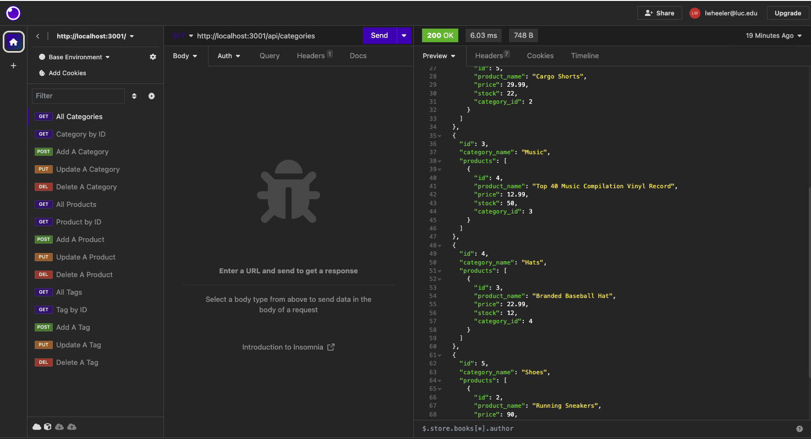
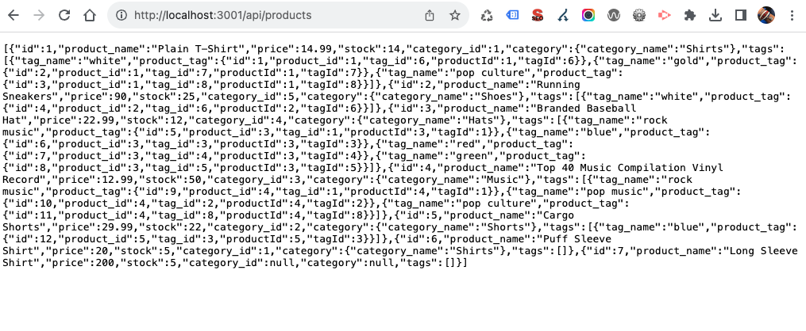
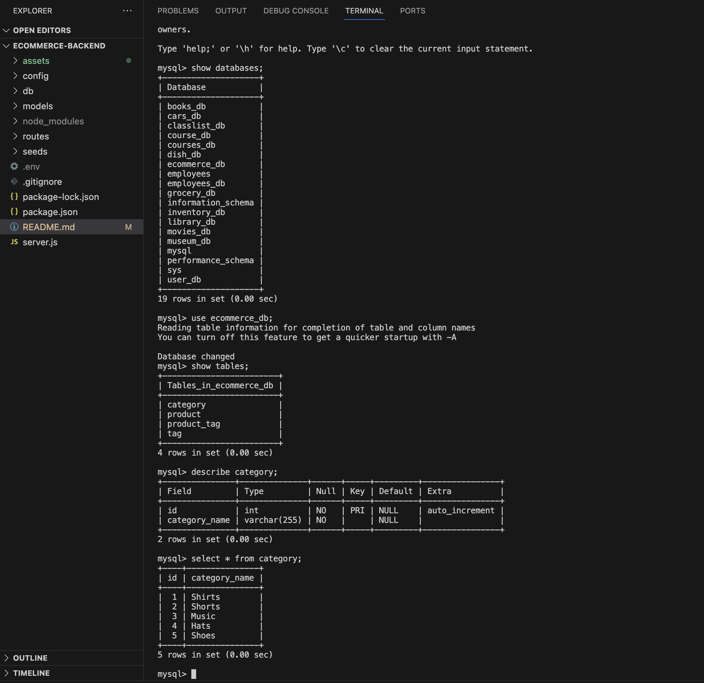

# E-commerce Back End
Bootcamp Module 13: Object-Relational Mapping (ORM) Challenge - E-commerce Back End

## ORM Challenge: E-commerce Back End
In this project, we were asked to build the back end for an e-commerce site using Express.js API where we configured it to use Sequelize to interact with a MySQL database.

## URLs submitted:
* My Github Repo URL: https://github.com/lenzlee/ecommerce-backend

* Video Walk-Through (via YouTube): https://youtu.be/U32ETWlEOEU

* Video Walk-Through (via Awesome Screenshot): https://www.awesomescreenshot.com/video/21915571?key=cbcc6ed09cb37e491b339a5762effe49 

## References/Resources:
I mostly referred to our recent lessons/activities for this assignment. 

* Sequelize Package: https://www.npmjs.com/package/sequelize 

* dotenv package: https://www.npmjs.com/package/dotenv 

 * MySQL2 package: https://www.npmjs.com/package/mysql2 

## Acceptance Criteria:
* GIVEN a functional Express.js API
* WHEN I add my database name, MySQL username, and MySQL password to an environment variable file
* THEN I am able to connect to a database using Sequelize
* WHEN I enter schema and seed commands
* THEN a development database is created and is seeded with test data
* WHEN I enter the command to invoke the application
* THEN my server is started and the Sequelize models are synced to the MySQL database
* WHEN I open API GET routes in Insomnia Core for categories, products, or tags
* THEN the data for each of these routes is displayed in a formatted JSON
* WHEN I test API POST, PUT, and DELETE routes in Insomnia Core
* THEN I am able to successfully create, update, and delete data in my database

## Screenshots:

* Insomnia Screenshot | Get All Categories

* Local Host Screenshot | Get All Products

* MySQL Screenshot | Database, Tables, Category Table Fields, Category Data

